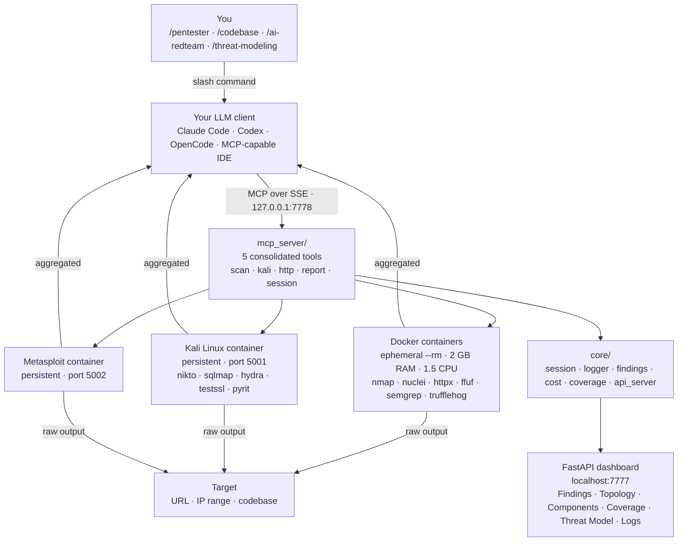

# Architecture

How the pieces fit together, the full component diagram, the repository layout, and the
artifacts a scan produces. For the MCP tool reference see [tools.md](tools.md).

---

## How it works

```
You (/pentester scan target.com)
  └── Your LLM (Claude / GPT / Gemini / local …)
        └── MCP server (python -m mcp_server)
              ├── Lightweight scanners — docker run --rm (nmap, nuclei, httpx, …)
              ├── Kali container       — persistent kali-mcp (nikto, sqlmap, ffuf, …)
              ├── Metasploit container — exploit validation
              └── FastAPI dashboard    — live findings at localhost:7777
```

The LLM decides what to run. Each tool's output is aggregated and returned to the model, which interprets the result and chooses the next action — pivoting deeper, skipping dead ends, or finalizing findings. Hard cost / time / call-count limits are enforced server-side. When any limit fires, the tool returns a stop signal and the agent writes the final report.

The default Claude Code and opencode installs register the server over **SSE on `127.0.0.1:7778`** (see `installers/install.sh`, `installers/start-mcp-server.sh`); stdio is only the custom-MCP-client path (`poetry run python -m mcp_server`).

---

## Component diagram



---

## Project layout

```
mcp_server/              MCP tool layer — 5 consolidated tools (LLM-callable)
  __main__.py            entry point  →  python -m mcp_server
  _app.py                FastMCP singleton + shared helpers (_run, _clip)
  scan_tools/            scan()    — nmap · naabu · httpx · nuclei · ffuf · spider
                                     subfinder · semgrep · trufflehog · fuzzyai · pyrit
                                     garak · promptfoo · metasploit · mobsf · mobsfscan
                                     (package; per-tool handlers in handlers_net · handlers_ai ·
                                      handlers_code · handlers_mobile · handlers_exploit)
  kali_tools.py          kali()    — freeform commands in the Kali container
  http_tools.py          http()    — raw HTTP requests + PoC saving
  report_tools/          report()  — findings · diagrams · notes · dashboard · coverage (package)
  session_tools/         session() — scan lifecycle · Kali infra · codebase target (package)
  scan_engine/           Per-tool response pipeline
    envelope/            Canonical tool-response wrapper (package) — summarise → store → plan → steer → QA
    planner.py           Next-action suggestions (suppressed while a directive is active)
    budget.py            Hard call / cost / time limit enforcement
    summarizers/         Tool-specific output summarisers (package)
    discovery.py         OpenAPI / GraphQL / schema discovery → endpoint registration
    artifacts.py         Raw output storage with artifact_id generation
    state.py             Scan-engine state helpers

core/                    Server infrastructure (packages)
  session/               Scan scope, depth presets, hard limits, scan_mode, known_assets, setup gates
  api_server/            FastAPI web server (dashboard + REST API) — serve.py · smith/ · routes/ · mermaid.py
  graph/                 Knowledge-graph world-model (build · chains · model · paths · primitives · views)
                         — backs report(action='chain', type='suggest')
  coverage/              Endpoint × technique coverage matrix (artifact_id enforced)
  qa_agent/              QA daemon — depth enforcement, HIR triggers, steering directives
  adjunction/            Senior-review adjudication gate (rubric · verdict · directive)
  notifiers/             Telegram · Slack · Discord notification backends
  findings.py            findings.json read/write
  logger.py              Structured session log → logs/pentest.log
  quick_log.py           Fast structured log consumed by the QA daemon
  steering.py            Steering directive queue (steering_queue.json)
  cost.py                Cost tracking per tool invocation
  oob.py                 Out-of-band callback server (blind-vuln confirmation)
  wishlist.py            Non-blocking agent→operator resource backlog

tools/                   Docker tool definitions + runners
  base.py · docker_runner.py · kali_runner.py · metasploit_runner.py · sandbox_runner.py
  mobsf_runner.py · mobsfscan.py · docker_cli.py
  nmap / naabu / httpx / nuclei / ffuf / subfinder / semgrep / trufflehog / fuzzyai
  kali/                  Kali image (Dockerfile + pyrit_runner.py + playwright_spider.py)
  metasploit/            Metasploit image (Dockerfile + msfconsole HTTP shim)

skills/                  Slash command definitions (git submodule)
                         35+ skills covering recon → exploit → report → remediate

dashboard/               Dashboard SPA (index.html + js/ + tabs/)
threat-model/            Threat model reports (auto-displayed in the dashboard)
tests/                   pytest suite
logs/                    Session logs
pocs/                    Saved proof-of-concept HTTP requests
docs/                    Documentation (+ docs/gifs/ demo gifs)

installers/
  install.sh                     Claude Code installer
  install_codex.sh               Codex installer
  install_opencode.sh            OpenCode installer (BYO LLM)
  uninstall.sh                   Remove MCP config and installed skills
  opencode-pentest-recovery.mjs  Compaction recovery plugin for OpenCode

.codex/                          Codex project hooks
AGENTS.md                        Codex project instructions
```

---

## What you get out

Every scan produces a structured set of artifacts you can hand to a developer, a manager, or a vendor on day one:

| Artifact | Where | What it's for |
|---|---|---|
| `findings.json` | repo root | Machine-readable findings + diagrams |
| `pocs/*.http` | repo root | Raw HTTP PoCs (open in Burp Repeater) |
| Live dashboard | `localhost:7777` | Findings, Topology, Components, Coverage, Threat Model, Logs |
| Coverage matrix | dashboard tab | Endpoint × technique tracking — proves what you tested |
| Code patches | inline edits | One per finding, generated by `/remediate` |
| Threat model | `threat-model/*.md` | PASTA + STRIDE write-up + diagrams |
| CVE packages | via `/request-cves` | MITRE form, GHSA draft, vendor email, full disclosure |
| Session log | `logs/pentest.log` | Full audit trail of what the agent decided and why |
| QA state | `qa_state.json` | Live QA alerts, steering directives, and Smith's acknowledgements |
| Steering queue | `steering_queue.json` | Active depth-enforcement directives injected by the QA daemon |
| Training data | `logs/smith-events/` | Redacted, schema-versioned event stream per engagement — decisions → actions → results → findings. Accumulates across scans and distills into a local **LoRA adapter** that runs *as Smith*. See **[training-data.md](training-data.md)**. |
