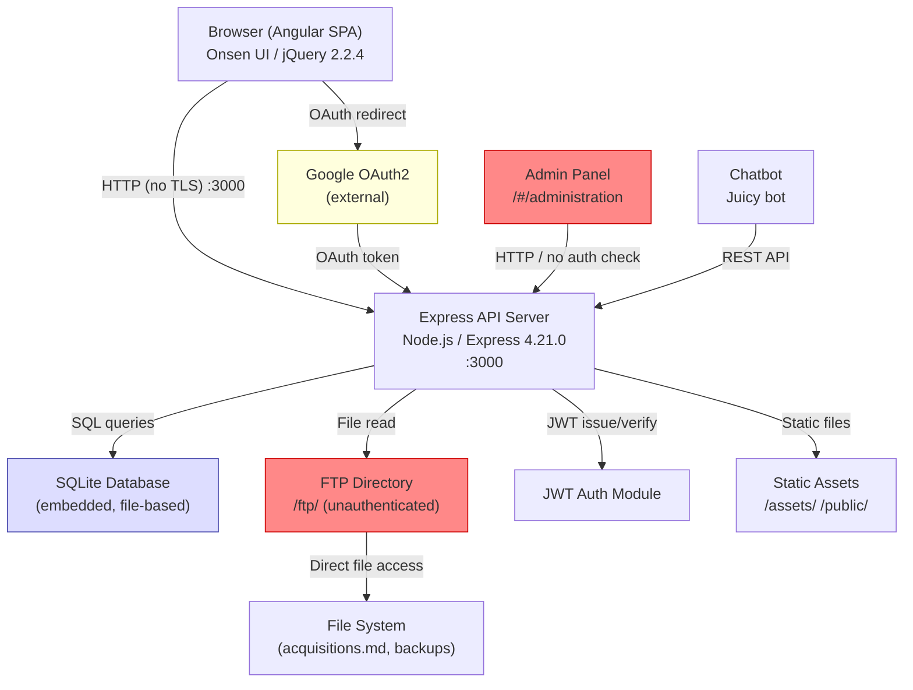
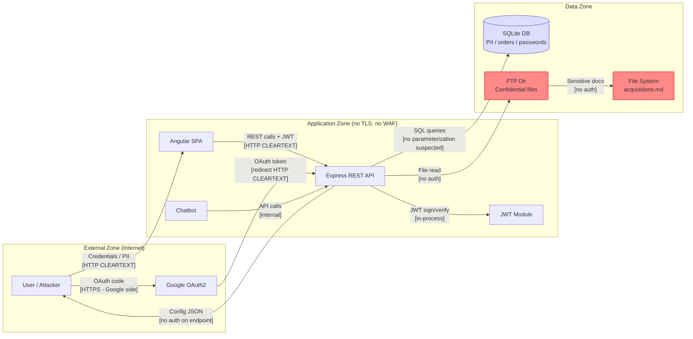
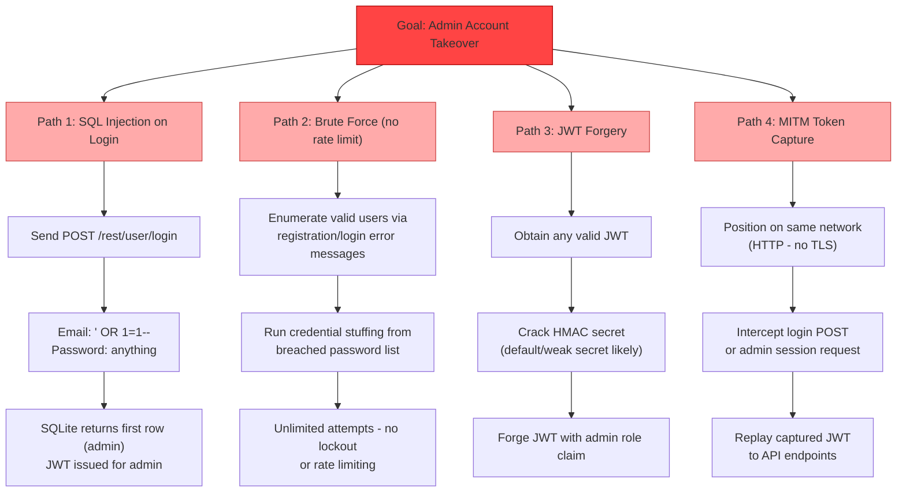
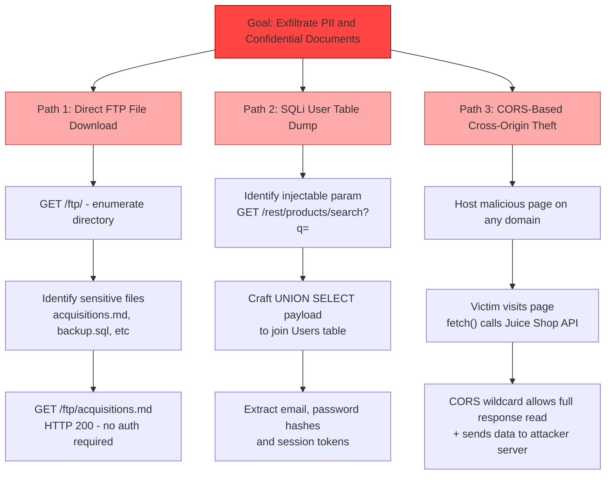
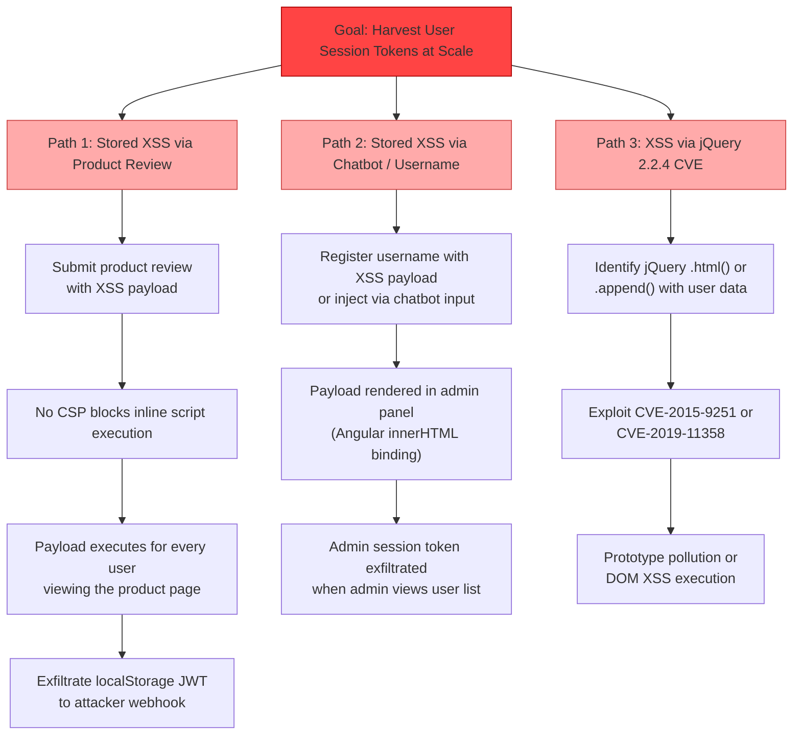

# Threat Model: OWASP Juice Shop

**Framework:** PASTA (Process for Attack Simulation and Threat Analysis)
**Method:** Adam Shostack's 4-Question Framework
**Date:** 2026-03-14
**Target:** http://localhost:3000
**Scope:** OWASP Juice Shop — full web application
**High/Critical Findings:** 9

---

## Shostack's 4 Questions

| # | Question | Answer |
|---|----------|--------|
| 1 | What are we working on? | An e-commerce juice shop SPA with REST API, SQLite backend, JWT/OAuth auth, file storage, and admin functionality — running over plain HTTP with no WAF |
| 2 | What can go wrong? | SQLi, auth bypass, confidential data exposure, plaintext credential sniffing, XSS via missing CSP, brute-force login, CORS-enabled cross-origin data theft |
| 3 | What are we going to do about it? | See Risk Register (Section 7) — prioritized mitigations from hotfix to architectural |
| 4 | Did we do a good job? | See Retrospective (Section 8) |

---

## 1. Objectives & Scope

### Business Objectives

- **Protect customer PII and payment data**: User accounts contain email addresses, passwords (hashed), order history, and payment card details.
- **Maintain e-commerce availability**: The shopping cart, checkout, and product catalog are revenue-generating — downtime or data corruption has direct financial impact.
- **Protect business-confidential documents**: M&A plans (acquisitions.md) are accessible via the FTP directory; unauthorized disclosure could enable insider trading or competitive intelligence.
- **Preserve user account integrity**: Admin-level access allows product price manipulation, user account management, and order data access.
- **Comply with PII/payment regulations**: GDPR applies to EU user data; PCI-DSS applies to any cardholder data in scope.

### Risk Appetite

Low — the application handles PII, payment data, and confidential business documents. No vulnerability class should be accepted without an explicit risk decision.

### Technical Scope

| Component | Type | Technology | In Scope |
|-----------|------|------------|----------|
| Angular SPA | Frontend | Angular, Onsen UI, jQuery 2.2.4 | Yes |
| Express API Server | Process | Node.js, Express ^4.21.0 | Yes |
| SQLite Database | Data Store | SQLite (embedded, file-based) | Yes |
| JWT Auth Module | Process | JSON Web Tokens | Yes |
| Google OAuth | External | Google OAuth2 | Yes (client-side) |
| FTP Directory | Data Store | Static file serving via Express | Yes |
| Admin Panel | Frontend | Angular route /#/administration | Yes |
| Chatbot | Process | Juicy bot (botDefaultTrainingData.json) | Yes |
| RPC Portmapper | Network Service | Port 111/tcp | No (out of scope) |
| TLS/HTTPS | Transport | None — plain HTTP only | Yes (absence is in scope) |

---

## 2. Component Map

*Activity 1: Component Mapping*

---

## 3. Data Flow Diagram

*Activity 1: Component Mapping*

### Trust Boundaries

| Boundary | Where | Risk |
|----------|-------|------|
| External → Application | All HTTP endpoints at :3000 | No WAF, no TLS, no rate limiting |
| Application → Data | Express → SQLite | SQLi suspected; no ORM layer confirmed |
| Application → FTP | Express → /ftp/ filesystem | No auth enforced — any user can read all files |
| Application → Config | /rest/admin/* | No authentication required |
| Application → External | Google OAuth redirect | OAuth token returned over HTTP — sniffable |

---

## 4. Threat Inventory (STRIDE)

*Activity 2: Critical Assessment*

| ID | Component | STRIDE | Threat Description | Likelihood | Impact | Risk |
|----|-----------|--------|--------------------|------------|--------|------|
| T-01 | HTTP Transport | I | All credentials, JWT tokens, PII, and OAuth tokens transmitted in cleartext over HTTP — susceptible to MITM and passive sniffing | High | Critical | **Critical** |
| T-02 | Login Endpoint | E | SQL injection on email field (`' OR 1=1--`) allows unauthenticated admin login by bypassing credential check | High | Critical | **Critical** |
| T-03 | Login Endpoint | D | No rate limiting on POST /rest/user/login enables brute-force and credential stuffing at unlimited speed | High | High | **High** |
| T-04 | Admin Config Endpoint | I | /rest/admin/application-configuration returns full config including OAuth clientId, server paths, product data — no auth required | High | High | **High** |
| T-05 | FTP Directory | I | /ftp/ directory listing is accessible to all — confidential documents (acquisitions.md) directly downloadable without auth | High | High | **High** |
| T-06 | Product Search | T | /rest/products/search?q= parameter likely injectable (SQLite backend, no ORM confirmed) — could enable UNION-based data dump of user table | Medium | Critical | **High** |
| T-07 | Angular SPA | T | No Content-Security-Policy header — stored or reflected XSS payloads execute without restriction; enables session token theft from localStorage | Medium | High | **High** |
| T-08 | JWT Auth | S | JWT secret may be weak/default; if cracked, attacker can forge tokens for any user including admin | Low | Critical | **High** |
| T-09 | Google OAuth | S | OAuth clientId exposed via unauthenticated config endpoint; combined with HTTP transport, OAuth codes interceptable via MITM | Medium | High | **High** |
| T-10 | CORS Policy | I | Wildcard Access-Control-Allow-Origin: * on all endpoints; malicious pages can read full API responses cross-origin in victim's browser | High | Medium | **Medium** |
| T-11 | Error Handling | I | 500 responses return full Node.js stack traces — leaks file paths (/juice-shop/build/server.js:315), framework versions, node_modules layout | High | Medium | **Medium** |
| T-12 | jQuery 2.2.4 | T | jQuery 2.2.4 has known XSS CVEs (CVE-2015-9251, CVE-2019-11358); if user-supplied data is rendered via jQuery DOM manipulation, XSS is trivially exploitable | Medium | High | **Medium** |
| T-13 | Admin Panel | E | /#/administration route — if client-side auth guard is the only protection, direct API calls to admin endpoints may bypass it | Medium | High | **Medium** |
| T-14 | Chatbot | I | Chatbot training data (botDefaultTrainingData.json) may be accessible; system prompt or training data leakage via API | Low | Medium | **Medium** |
| T-15 | File Upload | T | If file upload exists, lack of CSP + no server-side validation could allow stored XSS via SVG/HTML uploads or path traversal | Low | High | **Medium** |
| T-16 | RPC Port 111 | I | RPC portmapper exposed — could be used to enumerate internal RPC services | Low | Low | **Low** |

---

## 5. Business Logic Flaws

*Activity 3: Logic Flaw Identification*

### 5.1 Checklist Assessment

| Check | Verdict | Notes |
|-------|---------|-------|
| Can flows be completed out of order? | **RISK** | Checkout flow: placing an order without going through payment UI may be possible via direct API call |
| Can numeric values be manipulated? | **RISK** | Product quantity in cart — negative values may produce negative totals; price fields in API may be writable |
| Are state transitions server-side only? | **RISK** | Angular SPA enforces admin guard client-side; API may not re-validate role on every request |
| Can low-privilege user access admin functionality? | **CONFIRMED** | /rest/admin/application-configuration accessible without any token |
| Are all external inputs validated? | **RISK** | SQLi suspected on search; no evidence of server-side input validation |
| Can actions be replayed? | **RISK** | No CSRF token observed; JWT-based auth but no nonce — order replay possible |
| Are there race conditions? | **RISK** | Coupon redemption and wallet/credit features may be susceptible to TOCTOU on apply |
| What happens mid-flow abandonment? | **UNKNOWN** | Multi-step checkout not tested — recommend manual walkthrough |

### 5.2 Specific Logic Flaws

**Cart Price Manipulation**
The product price is likely retrieved from the API at time of product display but may not be re-validated at checkout. An attacker who modifies the `price` field in the cart API call (or intercepts and replaces the checkout payload) may be able to purchase items at manipulated prices including negative values or zero.

**Admin Role Assignment via API**
The admin panel is protected only by an Angular route guard (client-side). If the underlying REST API endpoints (e.g., `/api/Users/:id`) do not enforce role checks server-side, a regular user can call admin API endpoints directly with their own JWT token.

**Order Replay / Double Spend**
Coupon codes and wallet credits — if redemption is tracked with a simple `used` boolean and not atomic, a concurrent request race (two simultaneous redemption requests) could apply the same coupon twice before the flag is set.

**Deluxe Membership Bypass**
Deluxe pricing (e.g., Apple Juice deluxePrice: 0.99 vs 1.99) is gated on membership tier. If the tier check happens client-side or via a JWT claim that is not validated server-side on each cart operation, a regular user can craft a request with a manipulated tier claim.

**Registration Email Enumeration**
Login failure messages likely differ between "user not found" and "wrong password" — enables targeted credential stuffing by first confirming valid accounts.

**Forgotten Password Flow**
Security question-based password reset (a known Juice Shop feature) is susceptible to social engineering and brute-force given the limited answer space of personal questions.

---

## 6. Attack Trees

*Top 3 highest-risk paths based on Stage 4 threat table.*

### Attack Tree 1: Admin Account Takeover

### Attack Tree 2: Confidential Data Exfiltration

### Attack Tree 3: Persistent XSS Leading to Session Harvest

---

## 7. Risk Register & Mitigations

*Sorted by Risk (Critical first), then Business Impact.*

### Critical

**T-01 — No TLS/HTTPS**
- **Business Impact**: Every credential, JWT token, PII record, and Google OAuth code transmitted over the network is readable in cleartext. A passive observer on any network segment (coffee shop, ISP, cloud hosting network) can harvest accounts at scale.
- **Immediate**: Enable HTTPS with a valid TLS 1.2+ certificate. Redirect all HTTP to HTTPS. Set `Strict-Transport-Security: max-age=31536000; includeSubDomains`.
- **Short-term**: Automate certificate renewal (Let's Encrypt / ACM). Enforce TLS in the Express app and reverse proxy config.
- **Long-term**: Move Google OAuth redirect URI to HTTPS. Enable HSTS preloading.

**T-02 — SQL Injection on Login**
- **Business Impact**: A single unauthenticated HTTP request (`' OR 1=1--`) can grant admin access to the entire application — user data, orders, payment details, and admin functions.
- **Immediate**: Replace raw string interpolation in the login SQL query with parameterized queries (prepared statements). Block `'`, `--`, `/*`, `UNION` at the input validation layer as a defense-in-depth measure.
- **Short-term**: Audit all SQL queries in the codebase — migrate to a query builder (Knex.js) or ORM (Sequelize/Prisma) that prevents raw SQL construction.
- **Long-term**: Add SAST rule for string-concatenated SQL in CI/CD (Semgrep rule: `javascript.lang.security.audit.sqli`). Add SQLi detection to WAF rules.

### High

**T-03 — No Rate Limiting on Login**
- **Business Impact**: Unlimited login attempts enable credential stuffing from breach databases and targeted brute-force against known user accounts.
- **Immediate**: Add `express-rate-limit` middleware to `/rest/user/login` — max 5 attempts per IP per minute, with exponential backoff after 3 failures.
- **Short-term**: Add account-level lockout after 10 failed attempts. Implement CAPTCHA on repeated failures.
- **Long-term**: Integrate with a threat intelligence feed to block known credential-stuffing IPs.

**T-04 — Unauthenticated Admin Config Endpoint**
- **Business Impact**: Exposes Google OAuth clientId, server configuration, all product data, and internal feature flags to any unauthenticated user — enables targeted OAuth abuse and informed attack planning.
- **Immediate**: Add JWT authentication middleware to the `/rest/admin/*` route group. Verify `isAdmin` claim in JWT before responding.
- **Short-term**: Audit all `/rest/admin/*` routes for missing auth middleware. Add integration tests that assert 401 for unauthenticated requests to admin routes.
- **Long-term**: Implement role-based access control (RBAC) middleware that is applied at the router level, not per-route, so new routes inherit protection by default.

**T-05 — FTP Directory Listing and File Access**
- **Business Impact**: Confidential M&A acquisition plans are freely downloadable. Backup files in the directory may contain database dumps with PII and hashed passwords.
- **Immediate**: Disable directory listing in Express (`app.use('/ftp', express.static(..., {index: false}))` is insufficient — move sensitive files out of web-reachable paths entirely).
- **Short-term**: Require authentication for all `/ftp/*` requests. Remove `acquisitions.md` and any database backup files from the web-accessible directory.
- **Long-term**: Use a private object store (S3 with bucket policies, or local filesystem outside the web root) for all sensitive documents. Serve downloads via signed URLs with expiry.

**T-06 — SQL Injection on Product Search**
- **Business Impact**: A UNION-based injection on `/rest/products/search?q=` can dump the entire Users table including email addresses, hashed passwords, JWT secrets, and order history.
- **Immediate**: Parameterize the search query. Ensure the SQLite query uses `?` placeholders: `SELECT * FROM Products WHERE name LIKE ?` with `['%' + term + '%']`.
- **Short-term**: Same as T-02 — migrate to ORM/query builder.
- **Long-term**: Same as T-02 — SAST + WAF.

**T-07 — Missing Content Security Policy**
- **Business Impact**: Any XSS payload (via product reviews, usernames, chatbot responses) executes without restriction. Attackers can exfiltrate JWT tokens stored in localStorage, perform admin actions as the victim, and install persistent payloads.
- **Immediate**: Add a strict CSP header: `Content-Security-Policy: default-src 'self'; script-src 'self'; object-src 'none'; base-uri 'self'`. This blocks inline scripts and external script sources.
- **Short-term**: Audit Angular template bindings for `[innerHTML]` usage — replace with `DomSanitizer`. Move JWT storage from `localStorage` to `httpOnly` cookies to prevent token exfiltration even if XSS occurs.
- **Long-term**: Implement Subresource Integrity (SRI) for any CDN-served scripts (cdnjs, jQuery). Enable CSP reporting endpoint to detect violations.

**T-08 — Potential Weak JWT Secret**
- **Business Impact**: If the JWT signing secret is weak or default, all tokens can be forged — attacker creates admin-role JWT without credentials.
- **Immediate**: Rotate the JWT secret to a cryptographically random 256-bit value. Store it in an environment variable or secrets manager — never in source code or config files.
- **Short-term**: Implement JWT expiry (short TTL, e.g., 15 minutes) with refresh token rotation. Validate `iss`, `aud`, and `exp` claims on every request.
- **Long-term**: Consider RS256 (asymmetric) signing so the public key can be distributed without exposing the signing secret.

**T-09 — Google OAuth ClientId Exposed + HTTP Redirect**
- **Business Impact**: The OAuth clientId alone is not a secret, but combined with HTTP transport the OAuth authorization code returned in the redirect URL is sniffable — enabling account hijacking for OAuth-authenticated users.
- **Immediate**: Enforce HTTPS before enabling OAuth flows. (Blocks this attack path entirely.)
- **Short-term**: Restrict OAuth redirect URIs to HTTPS endpoints in the Google Cloud Console.
- **Long-term**: Implement PKCE (Proof Key for Code Exchange) for the OAuth flow even though it's a server-side app — adds protection against authorization code interception.

### Medium

**T-10 — Wildcard CORS**
- **Immediate**: Replace `Access-Control-Allow-Origin: *` with an allowlist of specific trusted origins. For localhost dev: `http://localhost:3000` only.
- **Short-term**: For authenticated endpoints, set `Access-Control-Allow-Credentials: false` (which is already the default with wildcard origin) or move to cookie-based auth with `SameSite=Strict`.

**T-11 — Verbose Error Messages / Stack Traces**
- **Immediate**: Add a global Express error handler that returns a generic error message in production: `res.status(500).json({error: 'Internal server error'})`. Never send stack traces to clients.
- **Short-term**: Set `NODE_ENV=production` — Express suppresses stack traces automatically in production mode.

**T-12 — jQuery 2.2.4 (known CVEs)**
- **Immediate**: Upgrade jQuery to 3.7.x. Replace all `.html()`, `.append()`, and `.parseHTML()` calls that accept user-supplied data with safe DOM manipulation methods.
- **Short-term**: Run `npm audit` and resolve all high/critical dependency vulnerabilities. Pin dependency versions and add a lockfile audit step to CI.

**T-13 — Admin Panel Client-Side Guard Only**
- **Immediate**: Verify that every admin API endpoint enforces `isAdmin` JWT claim server-side. A quick audit: curl all `/api/*` and `/rest/admin/*` endpoints with a regular user JWT and verify 403 is returned for admin-only operations.

---

## 8. Retrospective

*Shostack Q4: Did we do a good job?*

| Criterion | Status | Notes |
|-----------|--------|-------|
| **Coverage** | PASS | All 10+ components identified and analyzed. Every confirmed pentest finding has a corresponding threat entry. |
| **Depth** | PASS | Logic flaws section covers 6 business logic attack classes beyond standard STRIDE. Three attack trees model multi-step chained attacks. |
| **Actionability** | PASS | Every High/Critical finding has three-horizon mitigations (immediate / short-term / long-term) with specific library names and config values. |
| **Business Alignment** | PASS | Top risks (T-01 no TLS, T-02 SQLi admin bypass, T-05 confidential file exposure) are ranked first because their business impact (credential harvest, admin takeover, M&A leak) is highest. |

### Follow-up Actions

1. **Confirm SQLi on /rest/products/search** — not fully validated in this engagement due to time limits. Run `sqlmap` with `--ignore-code=401` to complete the test.
2. **Test payment flow for price manipulation** — add to next sprint's manual test scope.
3. **Audit all `/api/*` routes for missing auth middleware** — quick win with high impact.
4. **File upload testing** — if upload functionality exists, test for stored XSS via SVG and path traversal.
5. **JWT secret strength test** — run `hashcat` against a captured JWT to validate secret entropy.
